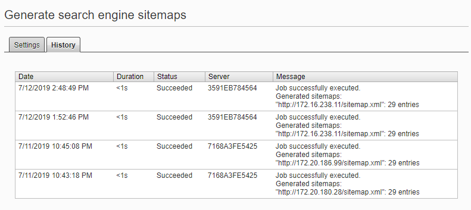
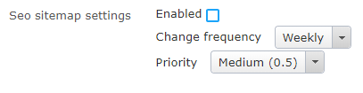

# Editor guide

## Configuration

Add a new sitemap definition and fill values for sitemap host and other fields:

- Path to include - only pages that have external url in the specified virtual path will be included in the sitemap
- Path to avoid - pages that have external url in the specified virtual path will not be included in the sitemap. If _Path to include_ specified this will be ignored.
- Root page id - the specified page and it's descendants will be listed in the sitemap. You can leave 0 to list all pages.
- Debug info - if checked sitemap will contain info about page id, language and name as a comment for each entry
- Format - currently standard or mobile (to specify [mobile content](http://support.google.com/webmasters/bin/answer.py?hl=en&answer=34648))

In case of multiple sites you choose for which site to host this sitemap:  

Each sitemap configuration must have a unique host name:

## Scheduled job

When configuration done go to the scheduled task "Generate search engine sitemaps" and run/schedule it to run in the necessary frequency. After the scheduled job has been run successfully you can view the sitemap(-s) by either opening the configured sitemap host or clicking "View" next to the sitemap configuration.

## Sitemap property

Per page (needs to be defined on page type) the editor can control if the page should be included in the sitemap, the frequency and priority.

